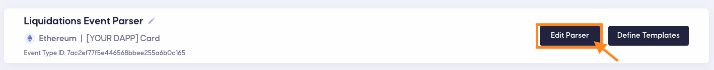

# On-Chain & Off-Chain Development

The Blockchain Development tool is intended to speed up the development process of creating [_topic_](https://notifi-network.github.io/docs/next/integration-overview/alerts-in-depth#topic) parsers for users.

**Requirements**:

- Install [Docker](https://docs.docker.com/get-docker/)
- [VS Code](https://code.visualstudio.com/download) is Recommended
- CLI supported on Mac OSX / Ubuntu Terminal
  > for Windows, paste the startup command into WSL

## Using the Blockchain Development CLI

### You'll Find The CLI Command Here

##### Important parameters:

- `NOTIFI_AUTH_TOKEN`: This token refers to a unique identity for your DAPP and JWT authentication to interact with Notifi Services
- `FUSION_SOURCE_ID`: This ID relates to the [_topic's_](https://notifi-network.github.io/docs/next/integration-overview/alerts-in-depth#topic) respective parser ID. This is particularly useful in CLI commands.

### Paste Command Into Terminal

_Copy and Paste Into Terminal_

_Expected Result_

### Common Commands

#### Authentication Commands

###### Creating Authentication

`$fusion auth` (Creating Authentication for a user to run any [Parser Commands](https://notifi-network.github.io/docs/next/notifi-hosted-development/on-chain-&-off-chain-development#parser-commands))

#### Parser Commands

###### Finding what commands are available in the CLI

`$fusion parser --help`

> Run this command if you forget what commands are available.

---

###### Creating Parser Environment

`$fusion parser init 'fusionSourceId'`

> Run this command if you need initialize a parser source development environment

_Note: This is automatically generated upon completion of the CLI Script._

---

###### Creating A New Parser Directory

`$fusion parser create`

> Run this command if you want to a new parser directory

---

###### Activating A Fusion Source

`$fusion parser activate 'cursor' 'fusionSourceId'`

**The Fusion Activate Command must be called at least once. This command requires the fusion source to be uploaded**

> Run this command if you want to activate a parser

---

###### Uploading A Fusion Source

`$fusion parser upload 'fusionSourceId'`

> Run this command if you would like to upload the respective Fusion Source

---

###### Generating a list of your parsers

`$fusion parser list`

> Run this command if you would like to see the state of your parsers

Example Response: 

---

###### Deactivating A Fusion Source

`$fusion parser deactivate 'fusionSourceId'`

> Run this command if you would like to deactivate a Fusion Source

---

### Parser Development States

Templated parsers are available in the following directory:

> `**~/fusion-sources/{YOUR_PARSER_NAME}**`

When developing a parser, expected states are to be seen in the following page:

> **The Fusion Activate Command must be called at least once**

##### When Parser _Hasn't_ Been Activated

##### When Parser _Has_ Been Activated

Here, parsers can be activated and deactivated outside of the CLI.

### Recommended Steps

1. Copy and Paste the Command into your terminal
2. Run The CLI Command
3. Run `npm i`
4. Modify Your Parser Code
5. [Upload Your Parser](https://notifi-network.github.io/docs/next/notifi-hosted-development/on-chain-&-off-chain-development#uploading-a-fusion-source)
6. [Activate Your Parser](https://notifi-network.github.io/docs/next/notifi-hosted-development/on-chain-&-off-chain-development#activating-a-fusion-source)
