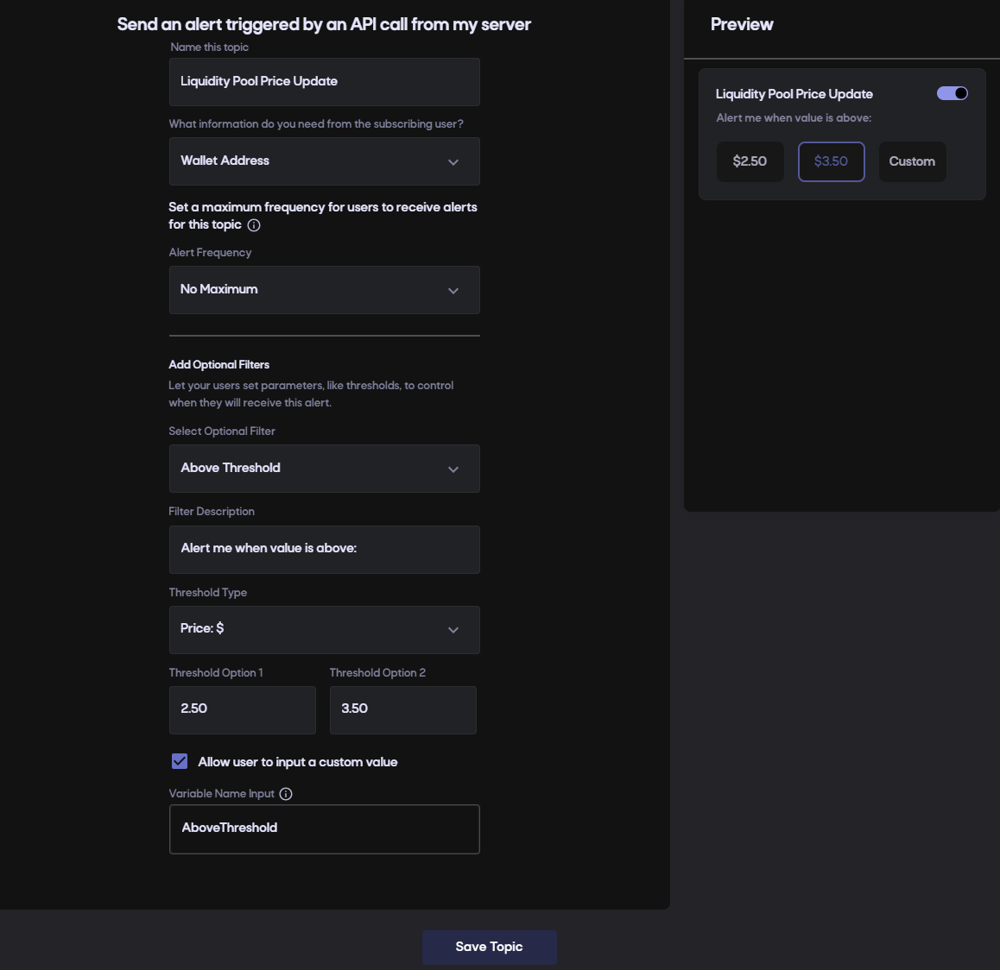
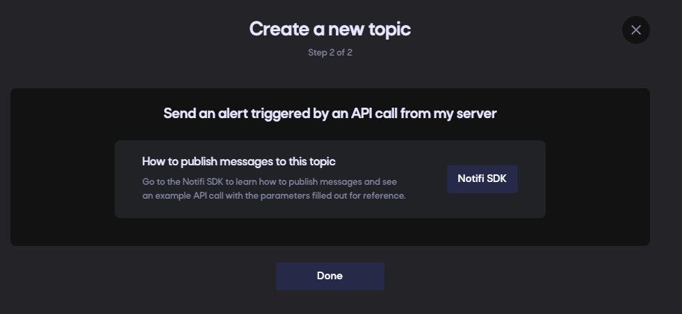

# Send alerts triggered by API call

Triggering notifications via API calls from your server can be done by creating a topic, and then using Notifi NodeJS SDK package [here](https://www.github.com/notifi-network/notifi-sdk-ts/packages/node-client) to trigger from your server

#### Step 1

Log in to the [Admin Portal](https://admin.notifi.network) (create an account if you haven't done so already) and head to the _Alert Manager_ page.

#### Step 2

Create your [topic](../integration-overview/alerts-in-depth.md#topic) by selecting the _Topics_ tab (default) and click on "+ Topic" in the top right, then select the "Send an alert triggered by an API call from my server". 


**For the steps below, we will provide examples as if you were creating a topic to let users know about liquidity pool price updates.**


You can define this [topic](../integration-overview/alerts-in-depth.md#topic) with or without any [filters](../integration-overview/alerts-in-depth.md#filter).

##### Without Additional Filters
This is the simplest usecase where users will be presented with a simple toggle to register for [alerts](../integration-overview/alerts-in-depth.md) on this [topic](../integration-overview/alerts-in-depth.md#topic). When you'd like to send notifications from your server, you can use our SDK to send to either everyone who has subscribed, or subsets of users based on the wallet address they registered with.


##### With Additional Filters
This allows your users to fully customize alerts even further. An example of this would be a liquidity pool price update, where your users subscribe to this topic, but would only want to receive updates if a particular value is above a certain threshold (even if you're publishing to the topic for a subset of users). For this experience, you will need to provide additional variables in the message you're publishing to the [topic](../integration-overview/alerts-in-depth.md#topic) with. This will be covered in more detail in subsequent steps.



#### Step 3

Upon creation of a new [topic](../integration-overview/alerts-in-depth.md#topic), you'll be presented with quick start guides and links to our SDK.


Once you click Done, you'll be taken back to the Alert Management page.
Make note of this "Event Type ID" that's specified for your [topic](../integration-overview/alerts-in-depth.md#topic). This will be used on your server to publish to this "Liquidity Pool Price Update" topic.


Configure your infrastructure to publish to your [topic](../integration-overview/alerts-in-depth.md#topic)

First, you want to install the NPM package in the NodeJS application that will be sending this notification.
```
npm install @notifi-network/notifi-node
```

Ensure this application is running in a secure location that can access sensitive credentials that will be used to initialize the Notifi NodeJS SDK. **Never allow the initialization credentials to ever be sent to a user's web browser.**

Decide where to store your initialization credentials. This is app specific. We highly recommend not storing in anything that's committed to source control such as git. Here are some ideas of how to store secrets for a NodeJS app. 


#### Step 4

Third step, make note of the topic identifier to use in a publishFusionMessage. To get started you may also copy/paste the sample code that's provided after you've created a topic. This must be copy/pasted in the same NodeJS app you did step (1) in.

Fourth step, you should modify the sample to only call the initialization routine once daily, and then customize the publishFusionMessage with your specific topic data. You may pass whatever JSON object you'd like. This JSON object is what will be used to help render notifications later. If you have defined any optional filters for the user to be able to specify when registering for an alert on this topic, then you must also make sure to pass in the required filter parameter variables in your call.

Now that you're triggering the notifications with your custom JSON object, you can configure your templates so that the notifications are rendered appropriated per destination.
