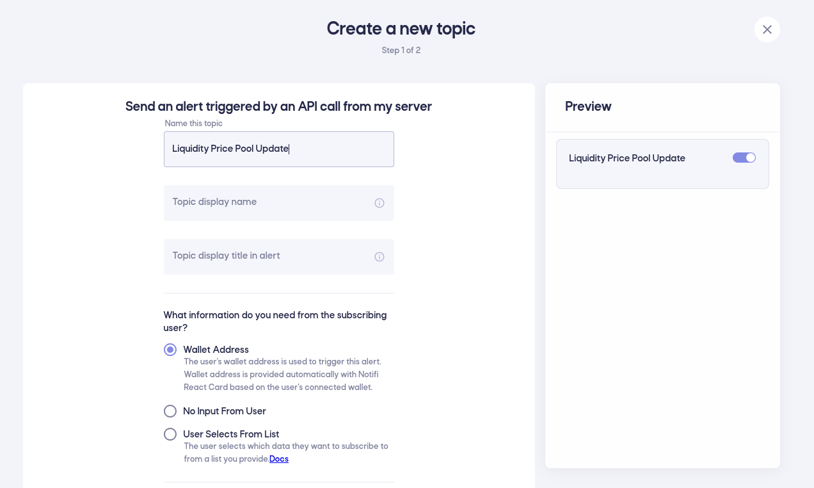
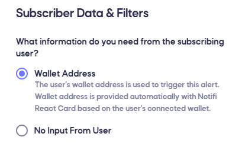
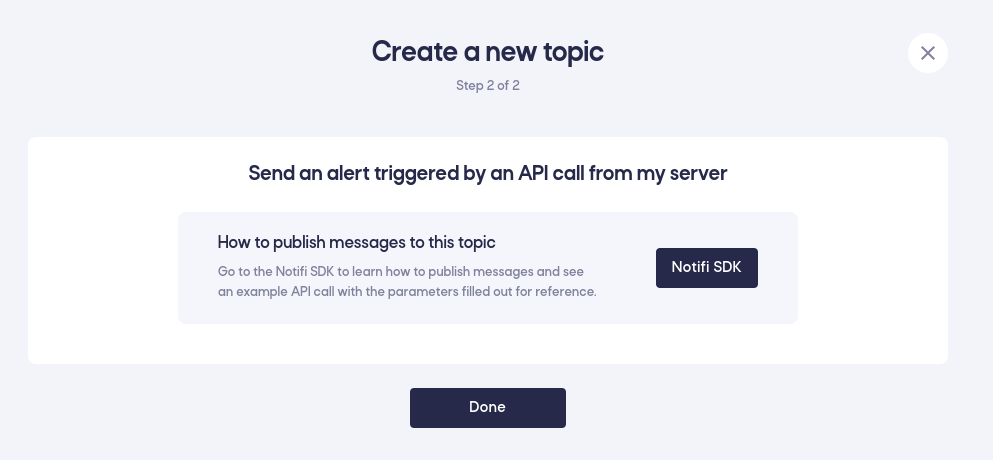
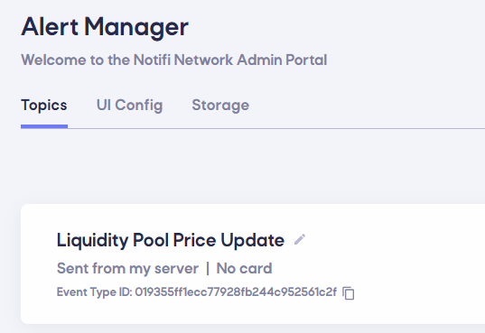

# Send alerts triggered by API call

Triggering notifications via API calls from your server can be done by creating a topic, and then using Notifi NodeJS SDK package [here](https://www.github.com/notifi-network/notifi-sdk-ts/packages/node-client) to trigger from your server

## Step 1

Log in to the [Admin Portal](https://admin.notifi.network) (create an account if you haven't done so already) and head to the _Alert Manager_ page.

## Step 2

Create your [topic](../integration-overview/alerts-in-depth.md#topic) by selecting the _Topics_ tab (default) and click on "+ Topic" in the top right, then select the "Send an alert triggered by an API call from my server". 


**For the steps below, we will provide examples as if you were creating a topic to let users know about liquidity pool price updates.**


### Topic Name

To start off, provide a name and display names for the topic:

- **Name this topic**: The name of the topic that will appear in Alert Manager (e.g. "Liquidity Pool Price Updates")
- **Topic display name**: The name of the topic that will appear in the subscriber card shown to users. Defaults to the topic name.
- **Topic display title in alert**: The display name of the topic that will appear in [Alert History](../for-users/index.md) (e.g. "Liquidity Pool Price Update")

### Topic Data {#topic-data}

When a user subscribes to a [topic](../integration-overview/alerts-in-depth.md#topic), they can be asked for some information to help address the notifications
they are interested in:
<br />

#### Wallet Address (default)

The user is asked for their wallet address when they subscribe (the Notifi React Card will handle this automatically by providing the connected wallet).
Use this if you are sending alerts that only concern a specific wallet address (such as a liquidation warning for a specific
user).<br />**NOTE: Anyone can provide any value here to subscribe. This is useful for general information that's public anyway and not sensitive to the owning user of the wallet, such as watching a whale's transaction activity. To guarantee only the owner of a wallet receives a message, see [Publishing securely to wallet owner](../alert-trigger/node-client/index.md#publish-secure).**

#### No Input From User

The user is not asked for any additional information. This is used for topics that broadcast to everyone, such as price pool updates, or if the server is going to always specify which wallet ***owner*** should receive a message.
<br />**NOTE: This is recommended if your server will always be leveraging: [Publishing securely to wallet owner](../alert-trigger/node-client/index.md#publish-secure) as the Alert is triggered by your server specifying which wallet owner should receive the notification.**

#### User Selects From List

The user is asked to specify one or more custom values from a list when they subscribe. This is used in more complex UI scenarios
where a user might be interested in one of several categories of update, such as getting updates on a price pair for an exchange.
For more info on how to set up this feature, view [this page](./subscription-parameters.md).

### Maximum Frequency

If you want to limit how often a user gets a message, regardless of how often you send alerts, set the **Alert Frequency**
option. This allows you to limit alerts anywhere from once per minute to once per week, with an additional option to only
ever send the alert to a user one time.

:::note

If you select the "User Selects From List" data above, this frequency will be tracked separately for each list item.
For instance, if an alert sends updates once per day and a user signs up for both item A and item B, they can receive one
notification for both items each day.

:::

### Optional Filters

You can also define optional [filters](../integration-overview/alerts-in-depth.md#filter):

##### Without Additional Filters
This is the simplest usecase where users will be presented with a simple toggle to register for [alerts](../integration-overview/alerts-in-depth.md) on this [topic](../integration-overview/alerts-in-depth.md#topic). When you'd like to send notifications from your server, you can use our SDK to send to either everyone who has subscribed, or subsets of users based on the wallet address they registered with.


##### With Additional Filters
This allows your users to fully customize alerts even further. An example of this would be a liquidity pool price update, where your users subscribe to this topic, but would only want to receive updates if a particular value is above a certain threshold (even if you're publishing to the topic for a subset of users). For this experience, you will need to provide additional variables in the message you're publishing to the [topic](../integration-overview/alerts-in-depth.md#topic) with. This will be covered in more detail in subsequent steps.


## Step 3

Upon creation of a new [topic](../integration-overview/alerts-in-depth.md#topic), you'll be presented with quick start guides and links to our SDK.



Once you click Done, you'll be taken back to the Alert Management page.
Make note of this "Event Type ID" that's specified for your [topic](../integration-overview/alerts-in-depth.md#topic). This will be used on your server to publish to this "Liquidity Pool Price Update" topic.



Configure your infrastructure to [publish](../alert-trigger/node-client/index.md) to your [topic](../integration-overview/alerts-in-depth.md#topic)

First, you want to install the NPM package in the NodeJS application that will be sending this notification.
```
npm install @notifi-network/notifi-node
```

Ensure this application is running in a secure location that can access sensitive credentials that will be used to initialize the Notifi NodeJS SDK. **Never allow the initialization credentials to ever be sent to a user's web browser.**

Decide where to store your initialization credentials. This is app specific. We highly recommend not storing in anything that's committed to source control such as git. Here are some ideas of how to store secrets for a NodeJS app. 

## Step 4

Once you've created your topic, make note of the topic identifier to use in a publishFusionMessage. To get started you may also copy/paste the sample code that's provided after you've created a topic. This must be copy/pasted in the same NodeJS app you did step (1) in.

Finally, you should modify the sample to only call the initialization routine once daily, and then customize the publishFusionMessage with your specific topic data. You may pass whatever JSON object you'd like. This JSON object is what will be used to help render notifications later. If you have defined any optional filters for the user to be able to specify when registering for an alert on this topic, then you must also make sure to pass in the required filter parameter variables in your call.

Now that you're triggering the notifications with your custom JSON object, you can configure your templates so that the notifications are rendered appropriated per destination.
